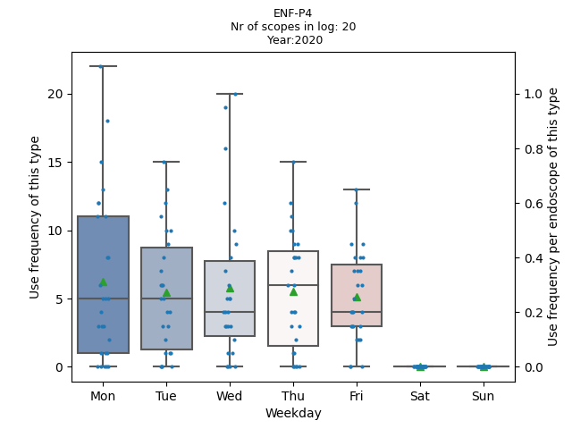
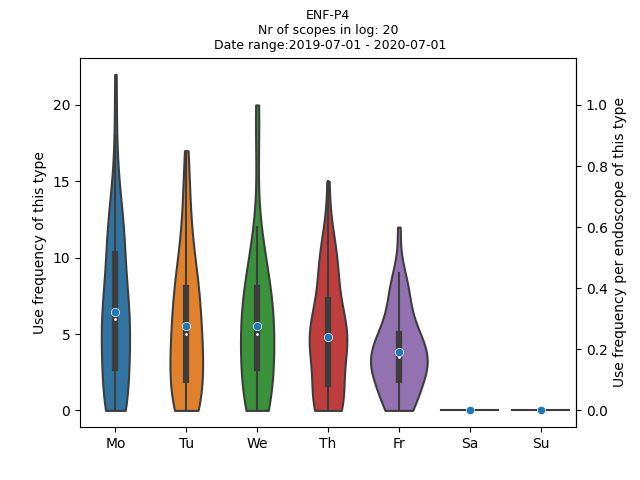

# Endoscope Disinfect Analysis

This script analyzes raw export data from Wassenburg Process Manager to generate box plots and violin plots containing per weekday use/disinfection frequency of flexible endoscopes. It automatically generates plots for every scope type in the export data. This allows for an accurate determination of the number of required endoscopes in a clinical setting.

An example Process Manager file is provided. Run runexample.py to generate the plots show above. It is also possible to group scopes that are interchangeable in clinical practice in one graph.

The titles of the columns in your Process Manager export file may not be identical to the ones used in this script. If this is the case, change them to the corresponding titles in your export file.

Note: The whiskers of the box plot show the minimum and maximum use frequency, the orange lines show the median use frequency and the green triangles show the mean use frequency. The white dots in the violin plots show the median use frequency while the blue circles show the mean use frequency.
